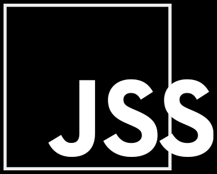

# Hello, I am Heorhii

- I am a **Front-End Developer** with a focus on **React** using **TypeScript**
  and with **Full Stack** skills (**MERN Stack**)
- 2.5+ years of **Web Development** experience
- 1 year of **React/TypeScript** commercial experience
- I'm currently **open to work**

## How to reach me:

- LinkedIn: **https://www.linkedin.com/in/heorhii-aksiuk/**
- Email: **aksiuk.heorhii@gmail.com**

---

#### Main stack:

 
«-------------------------»

#### Main tools:

 
«-------------------------»

#### Also worked with:

 
«-------------------------»

#### Currently learning:

<!--  -->

<!--  -->

<!--

---

 ## Experience working with technologies by years (since):

> 2021

> 2022

> 2023

 -->
